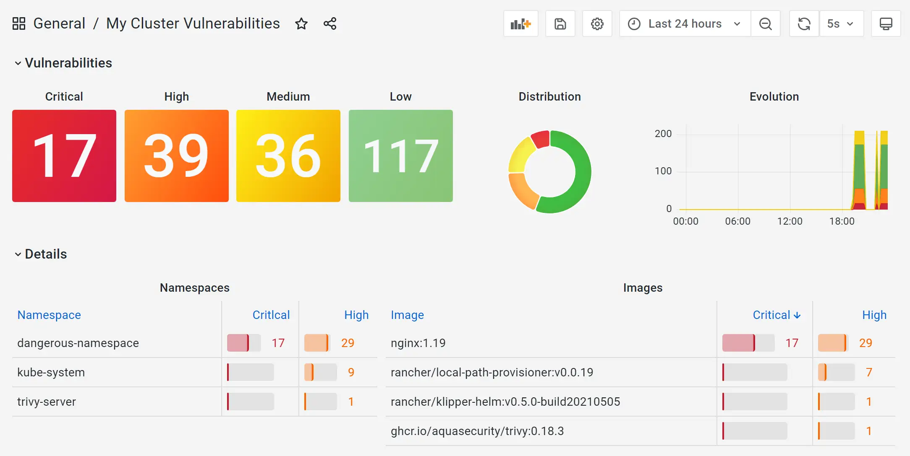

# Kubernetes Container Images Security Status

This service scans at regular intervals the container images used in your Kubernetes cluster, aggregates the vulnerabilities statistics for the namespaces and images, and exports them to Prometheus.

The security scanning is performed by [Trivy](https://github.com/aquasecurity/trivy) used in client/server mode.

Users can easily create alerts based on new vulnerabilities found in their clusters workloads, or build vulnerabilities dashboards in Grafana such as this one:


# Usage

A complete example cluster with Prometheus and a fully provisioned Grafana (as shown above) can be built with:

```shell
k3d cluster create --config=k3d-cluster-config.yml 
kubectl apply -f k8s/
```

Wait for all the pods to be up & running and open a web browser on http://localhost/d/jJAl3im7z/my-cluster-vulnerabilities?orgId=1&refresh=5s
(Note: grafana is using admin/admin by default)